\newpage
## 1.	RESUMO DO PROJETO

O projeto *História Digital: acervos e ferramentas digitais para pesquisa e ensino* busca promover a reflexão sobre os impactos teórico-metodológicos para o ofício de historiadores/as e professores/as de história dado o avanço dos acervos digitais de fontes primárias e das ferramentas digitais para pesquisa, escrita e ensino de História. Buscamos listar repositórios de fontes digitais on-line disponíveis para pesquisa e refletir sobre seus usos e implicações para História e seu ensino no Brasil, mais especificamente em cursos de licenciatura em História no estado da Bahia. Entre os anos de 2020/2021, sob o edital *Proppg 01/2020 (PIBIC/FAPESB)*, foi realizada a pesquisa, análise e catalogação digital das hemerotecas, além da construção de um *dataset* com os trabalhos publicados nos Anais dos Simpósios Nacionais de História da Anpuh, nos quais foram analisados os usos da Hemeroteca Digital Brasileira. Esse ano, na segunda etapa do projeto, buscamos focar a pesquisa nos usos dos acervos digitais de fontes primárias no ofício de historiadores/as, através da avaliação de práticas e reflexões teórico-metodológicas realizadas por docentes de cursos de História das Universidades Federais com campi no estado da Bahia sobre suas pesquisas nesses acervos. Ao final, tanto as reflexões quanto os dados produzidos, serão publicizados no portal do curso de História da Unilab/Malês e no Github para acesso público, no intuito de contribuir tanto para a reflexão teórica sobre os usos de ferramentas digitais na pesquisa e ensino bem como a construção de ferramentas metodológicas e recursos digitais para futuras pesquisas.

## 2.OBJETIVOS

**Geral**

- Caracterizar e avaliar a consciência de docentes de cursos de História de IES federais do estado da Bahia acerca da "seletividade digital", dos vieses, limitações e lacunas dos acervos digitais e como eles e elas têm lidado e trabalhado com esse desafio apesar da carência de formação teórica e metodológica em boa parte dos cursos de humanidades no Brasil.

**Específicos**

1. Caracterizar a História Digital e os debates sobre heurística e hermenêutica;
2. Refletir sobre os impactos dos acervos digitais para o ofício do historiador e do professor de história;
3. Construir, aplicar e analisar questionários junto a docentes dos cursos de história das IES federais da Bahia acerca de suas práticas, usos e reflexões sobre acervos digitais, pesquisa e ensino.
4. Listar os principais repositórios de fontes digitais utilizados.
5. Construir repositório digital de acesso público com os dados e resultados da pesquisa

## 3. ATIVIDADES EXECUTADAS E METODOLOGIA UTILIZADA

Embora exista um cronograma de execução das atividades, o qual serve para orientar a pesquisa, as atividades se entrelaçam no decorrer dos meses, pois algumas duraram por quase todo o projeto. Assim vamos nos ater a explicar a metodologia para cada atividade, sem seguir a sequência do cronograma. O levantamento e a leitura bibliográfica ocorreram em boa parte dos meses, diante da necessidade de um suporte teórico para o desenvolvimento das atividades. As leituras priorizaram discussões relacionadas às práticas de uso de repositórios digitais online como fonte de pesquisa historiográfica e sobre o campo da História Digital. Durante todos os meses ocorreram reuniões de orientação. Boa parte dessa bibliografia já se encontrava disponível na biblioteca pública História Digital, hospedada no gerenciador de referências Zotero e desenvolvida na primeira fase do projeto, com acesso disponível [nesse link](https://www.zotero.org/groups/2216280/histria_digital). Nesta fase, fizemos a manutenção da biblioteca pois, achamos mais pertinente alinhar as atividades do projeto atual com o anterior, para sintetizar as buscas, sendo desnecessário construir uma nova biblioteca já que se tratava dos mesmos objetivos.

O [Zotero](https://zotero.org) é um software de código livre e aberto, gratuito, que busca, gerencia e armazena referências e citações, criando uma biblioteca de referências onde seus itens podem ser organizados em coleções (ANDRETTA; RAMOS; SILVA.2011). O programa possibilita gerar notas/fichamentos, tecer conexões/links entre as referências, atribuição de etiquetas/marcadores, entre outras funções, essa catalogação fica a critério do usuário. O Zotero permite ao usuário administrar sua biblioteca em mais de um dispositivo através da sincronização do programa a conta online no servidor de Zotero, isso possibilita acessar as informações armazenadas no computador, essa sincronização possibilita a criação de grupos e biblioteca compartilhada onde as edições feitas por um membro é acompanhado pelos demais dinamizando as construções. Outra função do software é sua integralização ao editor de texto, onde o software auxilia a gerar referências de citações no estilo selecionado pelo usuário, gera também a bibliografia a partir de todas as citações presentes no texto.

Passamos a discutir a bibliografia sobre a construção de questionários do tipo survey e sobre a metodologia, benefícios e limitações da utilização de aplicativos para a pesquisa. Utilizamos textos que abordaram a utilização do aplicativo *Google Forms*, o qual escolhemos para utilizar no projeto diante de ser uma gratuito, de baixa dificuldade de aprendizagem do manuseio e pela portabilidade entre sistemas e dispositivos, evitando inviabilizar o desenvolvimento da pesquisa por questões técnicas, entre outras questões.
 
Um dos objetivos do projeto é tornar o desenvolvimento da pesquisa pública, assim, escolhemos desenvolver todas as atividades em uma plataforma que permite gerenciar atividades e controlar versões de arquivo mantendo todas as ações ao longo do projeto, sem apagá-las. Para isso, usamos o [GitHub](github.com), que é uma plataforma gratuita da empresa Microsoft, que possui várias funções, entre elas a possibilidade de trabalho simultâneo e remoto entre várias pessoas, além de possibilitar a recuperação de arquivos editados anteriormente, pois o GitHub utiliza o Git, que é um sistema controlador de versões de código aberto. Para isso foi feito workshop com o professor Eric Brasil e com o Laboratório de Humanidades Digitais da UFBA – LABHDUFBA. Após a formação, estruturamos o repositório intitulado História Digital: Acervos e ferramentas digitais para a pesquisa e ensino no GITHUB, disponível [nesse link](https://github.com/Curso-de-Historia-Unilab-Males/historia-digital-PIBIC).

Em seguida, levantamos os dados dos contatos das universidades públicas do Estado da Bahia e do respectivo corpo docente que compõem os cursos de licenciatura e bacharelado de história. A partir desse levantamento criamos um banco de dados com tais contatos, disponíveis para acesso [aqui](https://github.com/Curso-de-Historia-Unilab-Males/historia-digital-PIBIC/tree/main/Contatos).

Seguimos pensando metodologicamente como construir o questionário, as sessões e perguntas. Assim, desenvolvemos um modelo de questionário semiestruturado, onde selecionamos dos recursos disponíveis no google forms as questões com respostas do tipo múltipla escolha, de escala linear, de resposta curta e de parágrafo. O questionário construído possui a seguinte estrutura:

- Apresentação
- Termo de consentimento (em desenvolvimento)
- Seção 1 – Mapeando os repositórios, com duas questões – neste bloco objetivamos identificar quais os repositórios estão sendo mais utilizados pelos docentes.
- Seção 2 – O Repositório enquanto metodologia, fonte e prática historiográfica, com onze questões - Este bloco de questões visa entender de que maneira os repositórios são utilizados e como isto tem impactado no ofício do historiador. Se há uma compreensão dos mecanismos de pesquisa e se existe uma reflexão teórica por parte do docente acerca do uso destes.
- Seção 3 – Os resultados, com quatro questões -Este bloco de questões busca refletir se os resultados obtidos durante o uso do repositório atende as necessidades das práticas de pesquisa dos docentes e se existe uma compreensão por parte dos docentes dos mecanismos de retorno destes resultados. 
- Seção 4 – Formação para pesquisa em repositórios digitais, com três questões – Este bloco de questões busca refletir se existe uma formação educativa para utilização dos repositórios enquanto prática de pesquisa.
- Seção 5 – Comentários -  Pedimos aos entrevistados, que quiserem, para apontar algo da utilização dos repositórios que não foi abordado no questionário  ou comentários em geral sobre a pesquisa. 

O formulário teve seu link divulgado através de e-mails enviados inicialmente às coordenações de curso solicitando o encaminhamento para os seus membros. Como não tivemos nenhuma resposta nos primeiros 15 dias, decidimos mudar de estratégia e enviar os emails diretamente aos docentes. Para isso, fizemos uma busca por seus contatos de e-mail nos sites das instituições/cursos. Entretanto, a maioria não estavam presentes. Para contornar esse problema, optamos por fazer uma busca pelos currículos dos docentes no Lattes e consultar seus últimos três artigos publicados. Esse método possibilitou que ampliássemos nossa lista de contatos. Com isso ficamos com os seguintes processos: 

- 17 e-mails enviados para as coordenações, secretarias de curso, e emails de professores coordenadores. 

- 8 instituições:
    - Uneb-Eunápolis: 4 professores 
    - Uefs: 20 professores -  uma resposta/questionamento, um endereço não encontrado. 
    - Uesc: 10 professores 
    - UFBA: 30  professores - 3 emails não encontrados, um professor respondeu parabenizando pelo trabalho e indicando a leitura de um artigo de sua autoria.
    - UNEB-conceição-de-coité: 20 professores
    - uneb-itaberaba: 9 professores 
    - uneb-jacobina : 9 professores - 3  emails não encontrados 
    - unilab-malês : 10 professores - uma devolutiva confirmando a resposta do questionário. 

- Total de 105 email enviados  (já excluindo os endereços que foram acusados como não encontrados )

- Tivemos 22 respostas ao questionário. Equivalente a 20,95% em relação aos 105 emails enviados.

## RESULTADOS ALCANÇADOS E DISCUSSÃO 

Referente aos resultados teóricos alcançados pela leitura e discussão da bibliografia, passamos a compreender a História Digital como um campo que envolve metodologia híbrida na qual é necessário estar atento às orientações de práticas próprias da historiografia, como a heurística, bem como a utilização de orientações para apuração de fontes em meios digitais, da ciência computacional. Concluímos que o processo de digitalização de uma fonte histórica é um processo complexo, embora as informações sejam as mesmas, necessitando de uma metodologia adequada (BRASIL e NASCIMENTO, 2020). 

Alcançamos a compreensão da necessidade de abordagens metodológicas diferentes entre uma fonte criada em meios digitais e fontes de outros formatos que foram digitalizados e, isso irá envolver a utilização de recursos como Optical Character Recognition (OCR). Também buscamos refletir sobre o rigor metodológico para a prática de pesquisa em meios digitais e isto envolve a investigação de informações complementares (metadados) (BRASIL e NASCIMENTO, 2020). Concluímos também sobre a importância de ferramentas de baixo custo e que possibilitem acessibilidade para garantir a produção de conhecimentos no campo da História Digital.

Construímos um banco de dados com o contato do colegiado de História de nove universidades sendo: Universidade da Integração Internacional da Lusofonia Afro-Brasileira – UNILAB, Universidade Federal da Bahia –UFBA, Universidade do Estado da Bahia campus: SALVADOR, CAETITÉ, ALAGOINHAS, CONCEIÇÃO DO COITÉ, JACOBINA, TEIXIERA DE FREITAS, ITABERABA, EUNÁPOLIS, Universidade Estadual de Feira de Santana – UEFS, Universidade Estadual de Santa Cruz – UESC, Universidade Estadual do Sudoeste da Bahia – UESB, Universidade Federal do Oeste da Bahia – UFOB, Universidade Federal do Sul da Bahia – UFSB, Universidade Federal do Recôncavo Baiano – UFRB e mais de 125 contatos dos docentes divididos entre estas universidades.  Lembrando que todos esses dados eram públicos e foram acessados através dos sites oficiais das instituições ou em publicações de acesso aberto. Link de acesso disponível [aqui](https://github.com/Curso-de-Historia-Unilab-Males/historia-digital-PIBIC/tree/main/Contatos).

O questionário, com um total de 21 questões, foi dividido em cinco blocos de questões (sessões) e notas explicativas dos blocos. Disponível para consulta em: Uso de repositórios de fontes e acervos digitais - Formulários Google. Com isso fizemos uma análise dos dados gerados através das  respostas. 

### Seção 1 – Mapeando os repositórios

Do total de 22 respostas, 20 participantes, que equivalem a 90,9%, responderam que fazem uso de repositórios online como fonte de pesquisa. Tivemos 2 respostas negativas, que equivalem a 9,1% das respostas. 

Todos os resultados apresentados em escala serão de 1 a 5. Onde o número 1 na escala está ligado ao menos relevante/não existente e o 5 representa o mais relevante/existente. Quando essa ordem estiver diferente, explicitamos no texto. Ver Imagem 1.

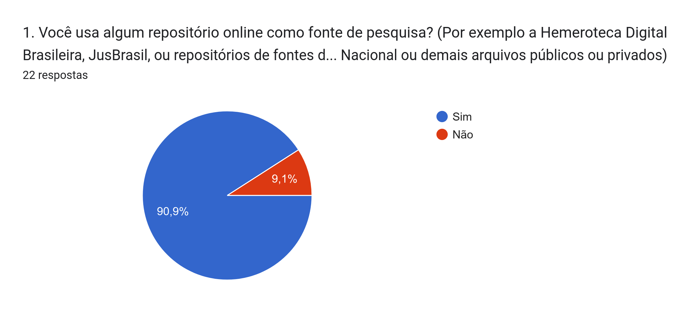

Essa seção possui duas questões – neste bloco objetivamos identificar quais os repositórios estão sendo mais utilizados pelos docentes.

Disponibilizamos uma lista com nomes de repositórios para que os professores indicassem os mais utilizados por eles, podendo ser selecionada mais de uma resposta. Com isso obtivemos os seguintes dados: 

- 15 participantes selecionaram a opção Repositórios Institucionais de Universidades Públicas (teses, dissertações, monografias) o que equivale a 75% do total; 
- 14 respostas para Repositórios da Capes, 70% dos professores; 
- Em 3º lugar temos a Hemeroteca Digital Brasileira, Portal Domínio Público e Biblioteca Nacional Brasileira com 13 respostas cada, equivalente a 65%; 
- 11 seleções para Acervos de Arquivos Públicos (Arquivo Nacional, APEB, APERJ, etc), 55% dos participantes;
- 8 respostas (40%) para Biblioteca Digital do Senado; 
- Com 7 seleções cada, equivalente a 35% dos participantes, utilizam o Internet Archives e Repositórios Institucionais de Universidades Privadas (teses, dissertações, monografias); 
- 6 professores selecionaram o FamilySearch, equivalente a 30%; 
- 5 marcaram Biblioteca do Congresso (EUA), 25%; 
- JusBrasil e Biblioteca Digital da Câmara dos Deputados com 4 seleções cada (20%); 
- 2 marcações para Portal Brasileiro de Dados Abertos, 10 %; 
- Na opção outros tivemos 8 respostas para cada repositório (apresentado pelos professores), algumas com mais de um exemplo dando à cada  5%.

Consultar Figura 2

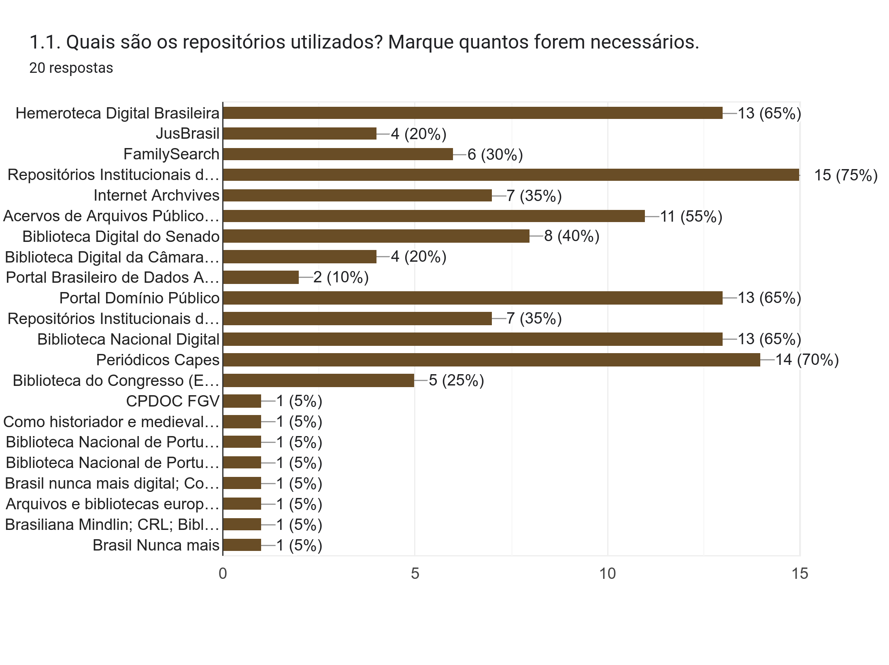

No ponto três da primeira seção perguntamos há quanto tempo os participantes utilizavam os repositórios online, com as seguintes opções de resposta: Até 6 meses; Até 1 ano; Até 5 anos; Mais de 5 anos. Não obtivemos nenhuma resposta para a opção de Até 6 meses; 2 respostas em Até 1 ano, correspondendo a 10% das respostas; 5 resposta em Até 5 anos, totalizando 25%; e 13  respostas em Mais de 5 anos, o que corresponde a 65% das respostas.

Consultar Figura 3

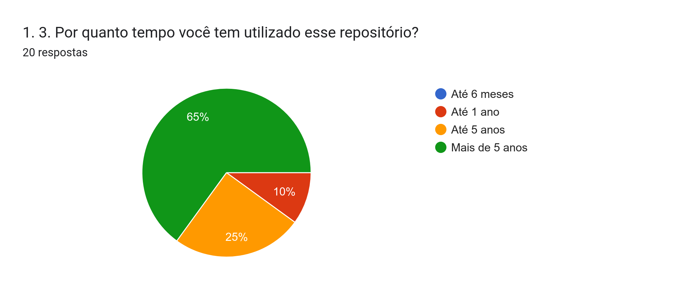

### Seção 2 - O Repositório enquanto metodologia, fonte e prática historiográfica  

Com duas questões, o  bloco objetiva entender de que maneira os repositórios são utilizados e como isso tem impactado no ofício do historiador. Se há uma compreensão dos mecanismos de pesquisa e se existe uma reflexão teórica por parte do docente acerca do uso destes.

Obtivemos 20 respostas, todas indicando que o uso dos repositórios online era utilizados em conjunto com outras fontes em suportes não digitais.

Elaboramos uma questão (questão 3 da seção 2) onde os participantes deveriam demonstrar em uma escala de 1 a 5 o quanto o uso dos repositórios online tinha mudado sua prática de pesquisa.  

- Nenhum participante selecionou a escala 1;
- Um participante selecionou a escala 2, 5%;
- Três participantes selecionaram a escala 3, 15%;
- Cinco participantes selecionaram a escala 4, 25%;
- 11 participantes selecionaram a escala 5, 55%.

Consultar Figura 4

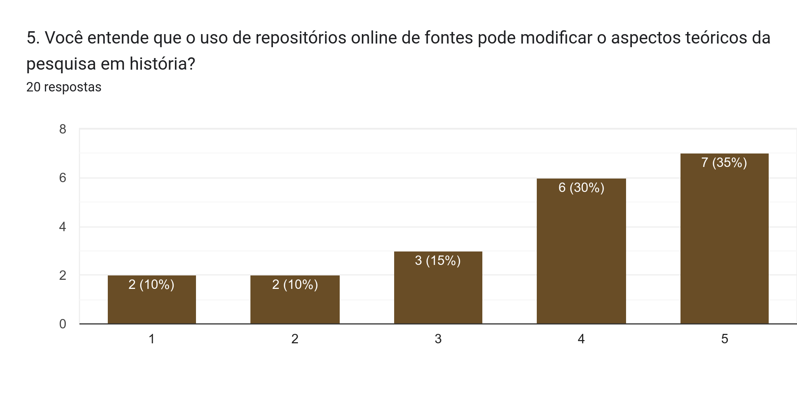

De forma geral os participantes entendem que  o uso dos repositórios online mudaram a prática da pesquisa, e em grande maioria as justificativas giram em torno da praticidade de acesso às fontes, por não precisar se deslocar aos repositórios físicos. 

Na questão 5, perguntamos se o uso dos repositórios on-line afeta também os aspectos teóricos da pesquisa, para além da metodologia. As respostas apontam para uma maioria de respostas positivas. 65% dos participantes responderam na escala 4 e 5, indicando um impacto elevado em suas reflexões teóricas.

Consultar Figura 5 

Essas respostas estão coerentes também com a pergunta 6. 80% dos participantes responderam com as escalas 4 e 5 indicando que entendem que o suso dos repositórios online possibilitam novas abordagens analíticas, e, por conseguinte, possibilitam a proposição de novas perguntas e novos problemas, mesmo sobre temas já trabalhados pela historiografia.

Consultar Figura 6

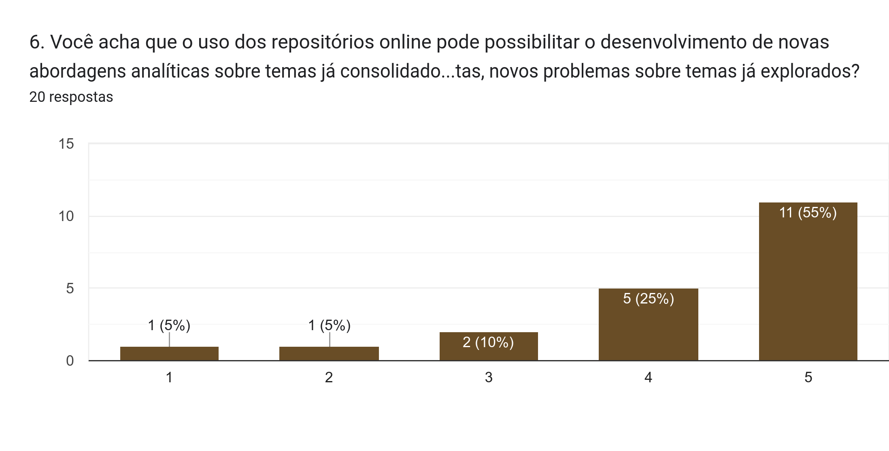

Quando questionamos aos participantes, se em algum momento de sua pesquisa houve uma reflexão metodológica  para/no uso dos repositórios digitais,obtivemos 11 respostas positivas (55%) e 9 respostas negativas (45%). 

Consultar Figura 7

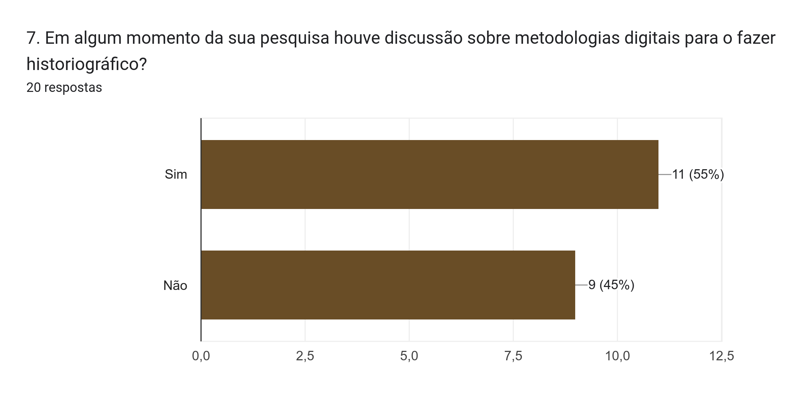

Em relação a avaliação crítica ao utilizar do meio digital para a pesquisa, 13 participantes (65%) responderam que fazem essa avaliação, enquanto que 7 responderam que não fazem (35%).  

Consultar Figura 8

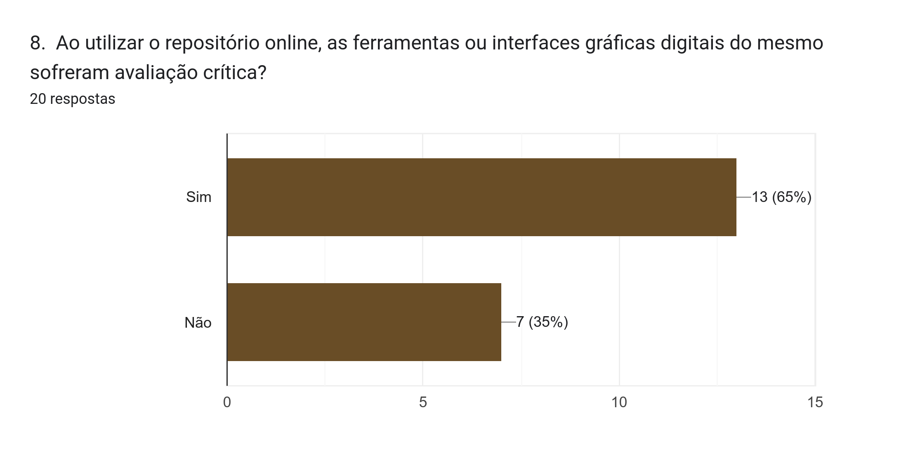

Ao perguntarmos se é possível através da interface dos repositórios utilizados avaliar o todo dos dados disponíveis, as opiniões/respostas se dividem. Pedimos que eles indicassem essa possibilidade em uma escala de 1 a 5: 

- Cinco participantes responderam 1 na escala, 25%;
- Três resposta no  2 da escala, 15%; 
- Quatro responderam o numeral 3 na escala, 20%;
- Cinco respostas na escala 4, 25%;
- Três participantes deram sua resposta no 5 da escala, 25%.

Consultar Figura 9

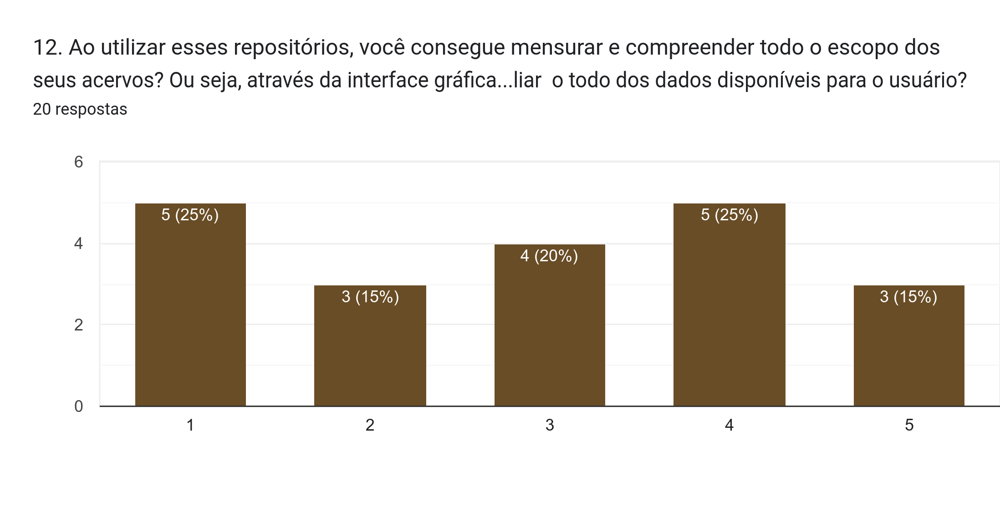

### Seção 3 - Resultados 

Neste bloco de quatro questões buscamos refletir se os resultados obtidos durante o uso do repositório atende as necessidades das práticas de pesquisa dos docentes e se existe uma compreensão por parte dos docentes dos mecanismos de retorno destes resultados. 

Em relação à satisfação no resultado das buscas nos repositórios tivemos as seguintes respostas (em uma escala de 1 à 5):

- Um participante respondeu na escala 1, 5%;
- Duas respostas na escala 2, 10%;
- Sete responderam na escala 3, 35%;
- Seis respostas na escala 4, 30%;
- E quatro participantes responderam na escala 5, 20%. 

Consultar Figura 10

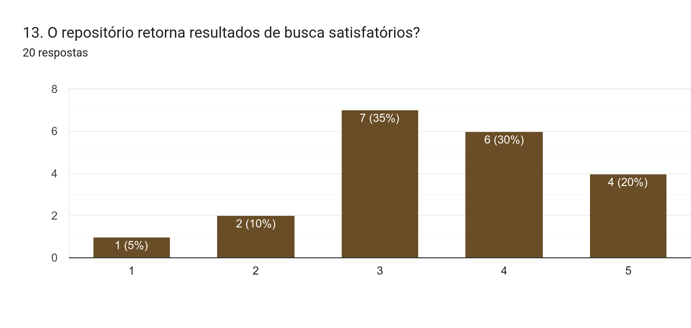

Referente à compreensão dos parâmetros empregados na busca, também respondida em escala de 1 à 5:

- Uma resposta na escala 1, 5%;
- Cinco respostas na escala 2, 25%;
- Cinco respostas na escala 3, 25%;
- Quatro respostas na escala 4, 20%;
- Cinco respostas na escala 5, 25%.

Consultar Figura 11

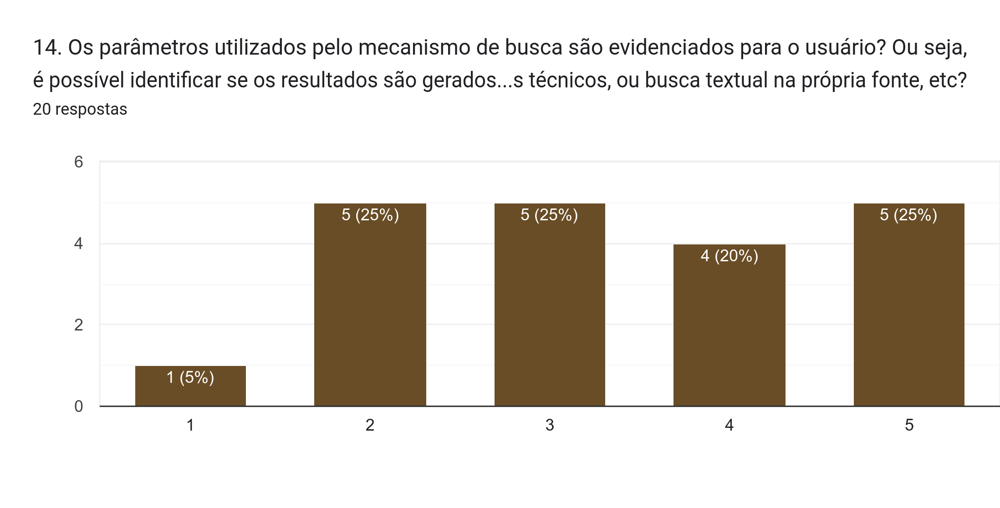

Foi avaliado pelos participantes (em escala de 1 à 5) se os resultados obtidos em suas buscas representam um retrato fidedigno do acervo pesquisado:

- Duas respostas na escala 1, 10%;
- Quatro respostas na escala 2, 20%;
- Quatro respostas na escala 3, 20%;
- Oito resposta na escala 4, 40%;
- Duas respostas na escala 5, 10%.
Consultar Figura 12

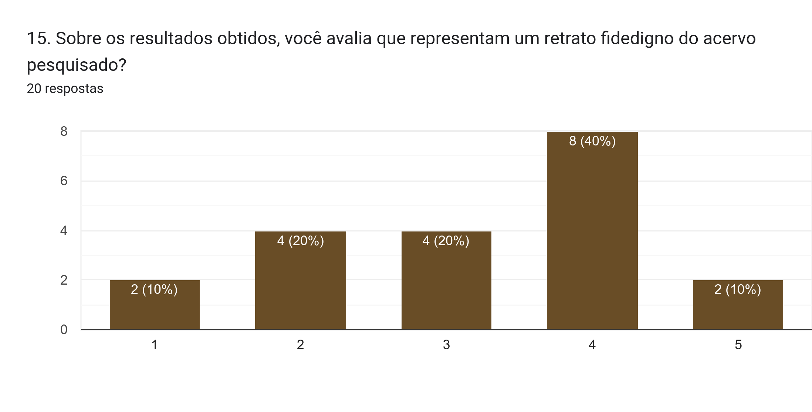

Sobre o repositório apresentar algum tipo de erro frequente que atrapalhe seu uso:

- Duas respostas na escala 1, 10%;
- Uma resposta na escala 2, 5%;
- Seis respostas na escala 3, 30%;
- Seis respostas na escala 4, 30%;
- Cinco respostas na escala 5, 25%.

Consultar Figura 13
 
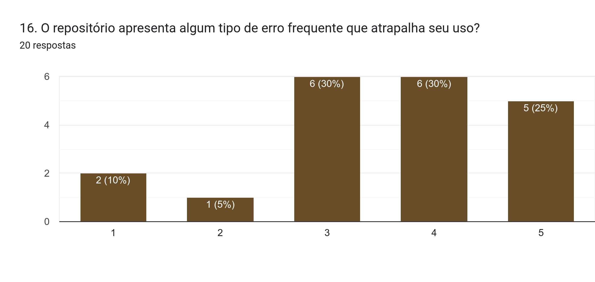

Nesta seção as respostas estavam bem distribuídas dentro das escala, ainda assim os maiores números estão entre as escalas 3 e 5.  Mesmo com uma porcentagem grande de respostas nessas escalas em relação a presença de erros nos repositórios, também tivemos uma porcentagem relevante na escala de satisfação com os resultados obtidos.  

### Seção 4 - Formação para pesquisa em repositórios digitais 

Com quatro questões, este bloco busca refletir sobre a formação especializada para utilização dos repositórios enquanto prática de pesquisa.

Em relação ao grau de confiança para utilizar os repositórios online de fontes digitais:

- Nenhuma resposta na escala 1;
- Nenhuma resposta na escala 2;
- Três resposta na escala 3, (13,6%);
- Onze respostas na escala 4, (50%);
- Oito respostas na escala (36,4%).

Consultar Figura 14

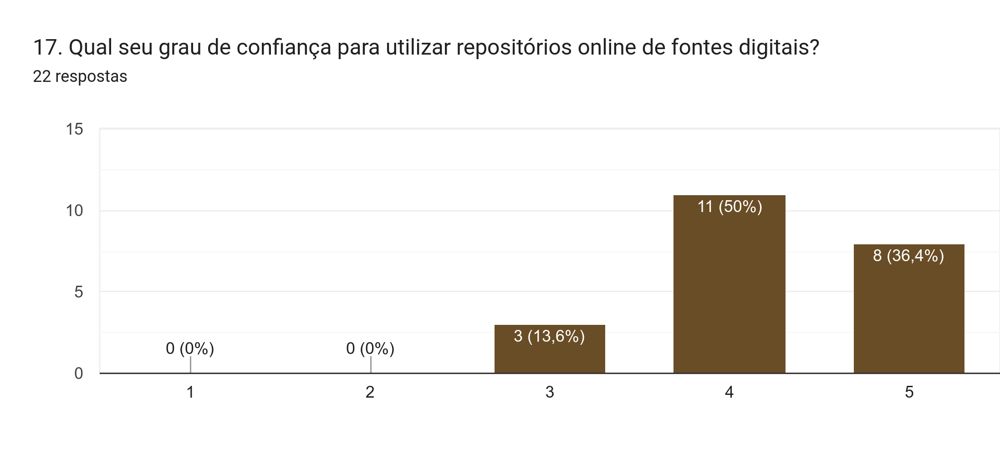

Questionamos aos participantes se para eles a atual formação em História atende os desafios do uso de repositórios online de fontes digitais, pedimos que respondessem em escala de 1 à 5. Nessa questão, a resposta 1 equivale a “Atende” e 5 a “Não atende”: 

- Na escala 1 tivemos 2 respostas (9,1%);
- Na escala 2 tivemos três respostas (13,6%);
- Na escala 3 tivemos quatro respostas (18,2%);
- Na escala 4 tivemos seis respostas (27,3%);
- Na escala 5 tivemos sete respostas (31,8%).

Consultar Figura 15 

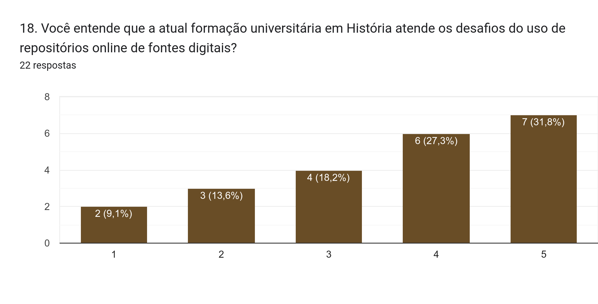

Sobre os cursos possuírem alguma disciplina que trabalhe conceitos, métodos e ferramentas digitais para o fazer historiográfico, obtivemos as seguintes respostas:

- 7 respostas positivas (31,8%);
- 13 respostas negativas (59,1%);
- 2 participantes não souberam (9,1%).

Consultar Figura 16

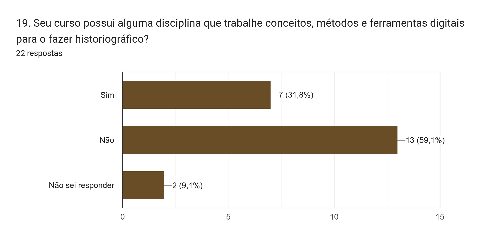

Dos 22 participantes, 99,5% gostariam de ter formação em ferramentas digitais que possam potencializar o seu trabalho de investigação, com apenas 1 participante respondendo negativamente (0,5%). 

Consultar Figura 17

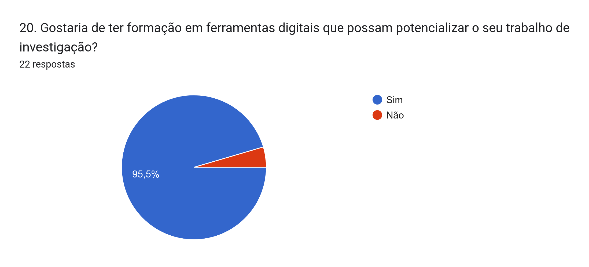

Aos que responderam positivamente pedimos que indicassem a(s) forma(s) como gostaria de usar as ferramentas digitais dentre as opções apresentadas: 

- Instrumentos de obtenção e gestão de dados, foi selecionada por 11 participantes (55,4%);
- Instrumentos de análise, foi selecionado por 15 participantes (71,4%);
- Acesso a base de dados, foi selecionada por 16 participantes (76,2%);
- Programação, foi selecionado por 5 participantes  (23,8%);
- Ferramentas ligadas à construção de acervos e exposições, foi selecionado por 6 participantes (76,2%);
- Meio de comunicação e disseminação de pesquisas, foi selecionado por 11 participantes (55,4%);
- Ensino de história, foi selecionado por 6 participantes (76,2%).

Consultar Figura 18

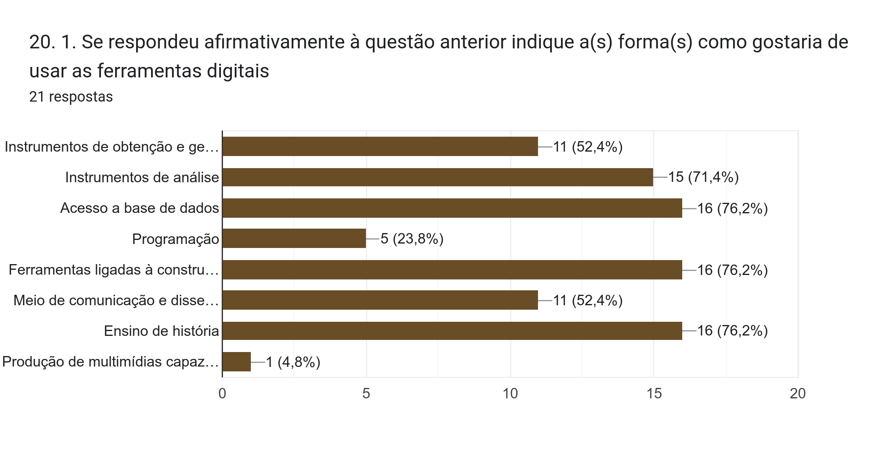

Ainda com essa amostra de 99,5% (21 participantes ) apresentamos opções de  métodos  eles teriam maior interesse para aplicar na sua área de investigação:

- Sistema de informação geográfica, foi selecionado por 3  participantes (14,3%);
- Análise de redes, foi selecionado por 4 participantes (19%);
- Análise de séries temporais, foi selecionado por 8 participantes (38,1%);
- Análise qualitativa, foi selecionado por 12 participantes (57,1%);
- Análise textual, foi selecionado por 14 participantes (66,7%);
- Edição digital, foi selecionado por 8 participantes (38,1%);
- Gestão de base de dados, foi selecionado por 10 participantes (47,6%).

Consultar Figura 19

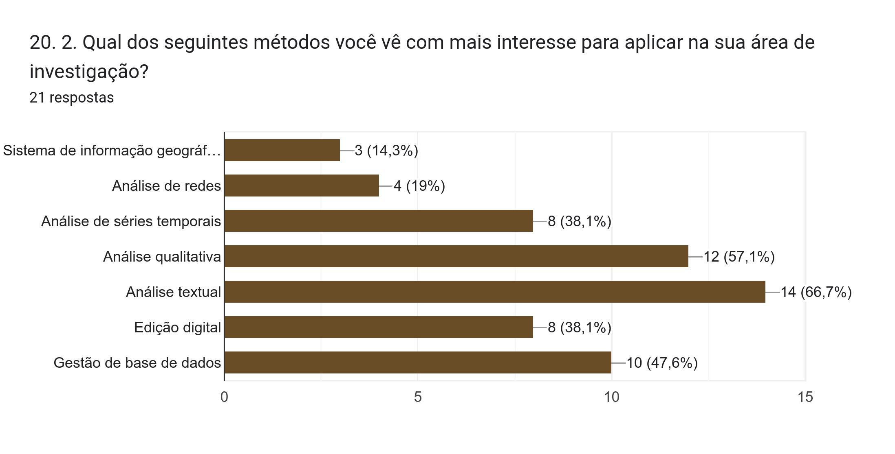

Esta seção nos mostra que a maioria dos cursos, representados por seus professores, não possui matérias que trabalham conceitos, métodos e ferramentas digitais para o fazer historiográfico. Ao mesmo tempo, a grande maioria dos participantes gostaria de ter formação em ferramentas digitais.

Ao mesmo tempo, é interessante notar que apenas 5 participantes  (23,8%) indicaram que têm interesse em aplicar linguagens de programação em suas pesquisas - a menor porcentagem entre as opções indicadas no formulário. Contudo, na questão 20.2, sobre os métodos de maior interesse, três das quatro respostas mais citadas - Análise textual, Análise qualitativa e Análise de séries temporais - são profundamente dependentes da aplicação de scripts (cadeias de códigos) escritos em variadas linguagens de programação.

Portanto, é possível notar uma certa discrepância entre o entendimento da importância da programação como ferramenta e as aspirações de utilização de métodos para a pesquisa histórica.  

### Seção 5 - Comentários 

Pedimos aos entrevistados, que quiserem, para apontar algum ponto da utilização dos repositórios que não foi abordado no questionário  ou comentários em geral sobre a pesquisa.  Tivemos 4 respostas:

- Uma resposta dizendo “sem comentários";
- Duas respostas parabenizando a iniciativa da pesquisa 
- Um participante informou que tem trabalhos publicados sobre o tema da pesquisa.  

Ao final, podemos concluir que a maioria dos participantes está ciente, mesmo que de forma parcial, da “seletividade digital” (COBURN, 2020) que marca os acervos de fontes digitais e digitalizadas utilizados por eles. Ao mesmo tempo notamos uma incipiente reflexão metodológica sobre os usos e impactos desses acervos e suas interfaces na pesquisa historiográfica. Entretanto, a reflexão metodológica é apresentada ainda de forma pouco estruturada e consistente, variando muito de entre os participantes e se limitando sobremaneira ao registro manual de alguns aspectos do processo de pesquisa.

Outra conclusão importante é a grande demanda por formação específica para a aplicação de ferramentas e métodos digitais entre os participantes. Demanda maior recai sobre métodos qualitativos de análise, ao mesmo tempo que há um baixo interesse na formação para utilização de linguagens de programação, demonstrando uma baixa compreensão da relação entre elas.

## 5. REFERÊNCIAS BIBLIOGRÁFICAS UTILIZADAS

ALMEIDA, F. C. de. **O Historiador e as Fontes Digitais**: uma visão acerca da Internet como fonte primária para Pesquisas Históricas. AEDOS, v.3, n. 8, 2011

ALVES, P. C. B.; NASCIMENTO, L. F. **Novas fronteiras metodológicas nas ciências sociais**. Salvador: EDUFBA - Editora da Universidade Federal da Bahia, 2018.

AYERS, E. L. The Pasts and Futures of Digital History. *History News*, v. 56, n. 4, p. 59, 2001.

BACA, M. **Introduction to Metadata**. Los Angeles: Getty Publications, 2008. BOLICK, C. M. Digital Archives: Democratizing the Doing of History. International Journal of Social Education, v. 21, n. 1, p. 122134, 2006.

BARROS, José D’Assunção. **História digital**: A historiografia diante dos recursos e demandas de um novo tempo. Petrópolis, RJ: Editora Vozes, 2022.

BRASIL, Eric; NASCIMENTO, Leonardo. Por uma História Social Digital: o uso do CAQDAS na pesquisa e escrita da Históra. In: BARROS, José D’Assunção (Org.). **História digital**: A historiografia diante dos recursos e demandas de um novo tempo. Petrópolis, RJ: Editora Vozes, 2022, p. 228–252.

BRASIL, E.; NASCIMENTO, L. F. História digital: reflexões a partir da Hemeroteca Digital Brasileira e do uso de CAQDAS na reelaboração da pesquisa histórica. *Revista Estudos Históricos*, v. 33, n. 69, p. 196219, 1 jan. 2020.

C MARA, S.; BENICIO, M. História Digital: entre as promessas e armadilhas da sociedade informacional. *Revista Observatório*, v. 3, n. 5, p. 3856, 2017.

CAVALCANTI, M. T. Os websites dos centros de documentação e a pesquisa histórica: uso de fontes digitais. *Revista Observatório*, v. 3, n. 5, p. 169, 2017.

CHARTIER, R. **Os desafios da escrita**. São Paulo: UNESP, 2002. 

CHAUDHURI, B. B. (ED.). **Digital Document Processing**: Major Directions and Recent Advances. 1. ed. Londres: Springer-Verlag London, 2007.

COBURN, J. Defending the digital: Awareness of digital selectivity in historical research practice. *Journal of Librarianship and Information Science*, p. 113, 25 maio 2020.

COHEN, D. J. et al. Interchange: The Promise of Digital History. *The Journal of American History*, v. 95, n. 2, p. 452491, 2008.

ELO, K. Big Data, Bad Metadata: A Methodological Note on the Importance of Good Metadata in the Age of Digital History. In: FRIDLUND, M.; OIVA, M.; PAJU, P. (Eds.). . **Digital Histories**: Emergent Approaches within the New Digital History. [s.l.] Helsinki University Press, 2020. p. 103111.

FICKERS, A. Towards A New Digital Historicism? Doing History In The Age Of Abundance. *Journal of European History and Culture*, v. 1, n. 1, 2012.

FICKERS, Andreas; CLAVERT, Frédéric. On pyramids, prisms, and scalable reading. *Journal of Digital history*, n. jdh001, 2021. Disponível em: <https://www.journalofdigitalhistory.org/en/article/jXupS3QAeNgb>. Acesso em: 7 fev. 2022.FISH, A. et al. Birds of the Internet. Journal of Cultural Economy, v. 4, n. 2, p. 157187, 2011.

FORTES, A.; ALVIM, L. G. M. Evidências, códigos e classificações: o ofício do historiador e o mundo digital. *Esboços: histórias em contextos globais*, v. 27, n. 45, p. 207227, 19 jun. 2020.

FRIDLUND, M. Digital history 1.5: A middle way between normal and paradigmatic digital historical research. In: **Digital histories**: Emergent approaches within the new digital history. Helsinki: Helsinki University Press, 2020. p. 6987.

FRIESE, S. **Qualitative Data Analysis with ATLAS.ti**. Second Edition edition ed. Los Angeles: SAGE Publications Ltd, 2014.

GIBBS, F.; OWENS, T. The Hermeneutics of Data and Historical Writing. In: **Writing History in the Digital Age**. Ann Arbor, MI: University of Michigan Press, 2013. p. 159170.

GIL, T. L.; BRESCIANO, J. A. (editores). **La Historiografía ante el giro digital: Reflexiones teóricas y prácticas metodológicas**. Ediciones Cruz del Sur, 2015.

GOLD, M. K. **Debates in the Digital Humanities**. Minneapolis: University of Minnesota Press, 2012.

HART, J. Introduction: Digital History in African Studies. *History in Africa*, v. 47, n. 1, p. 269274, 1 ago. 2020.

HEIJDEN, T. VAN DER; FICKERS, A. Inside the Trading Zone: Thinkering in a Digital History Lab. *Digital Humanities Quarterly*, v. 14, n. 3, 2020.

HITCHCOCK, T. Confronting the Digital: Or How Academic History Writing Lost the Plot. *Cultural and Social History*, v. 10, n. 1, p. 923, mar. 2013.

JENSEN, H. S. Digital Archival Literacy for (all) Historians. *Media History*, v. 0, n. 0, p. 115, 10 jun. 2020.

KEMMAN, Max. **Trading Zones of Digital History**. Berlin: De Gruyter Oldenbourg, 2021. Disponível em: <https://www.degruyter.com/document/doi/10.1515/9783110682106/html>. Acesso em: 23 set. 2021.

KLEIN, L. F.; GOLD, M. K.; PROJECT MUSE. **Debates in the Digital Humanities 2019**. Baltimore, Maryland: Project Muse, 2019.

LUCCHESI, A. **Digital history e Storiografia digitale**: estudo comparado sobre a escrita da história no tempo presente (2001-2011). Mestrado - Rio de Janeiro: UFRJ, 2014.

LUCCHESI, A.; SILVEIRA, P. T. DA; NICODEMO, T. L. Nunca fomos tão úteis. *Esboços: histórias em contextos globais*, v. 27, n. 45, p. 161169, 19 jun. 2020.

MAYER-SCHÖNBERGER, V.; CUKIER, K. **Big Data**: A Revolution that Will Transform how We Live, Work, and Think. London: John Murray Publishers, 2013.

MILLIGAN, I. **History in the Age of Abundance?**: How the Web Is Transforming Historical Research. 328. ed. London; Chicago: McGill-Queens University Press, 2019.

NASCIMENTO, L. F. A Sociologia Digital: um desafio para o século XXI. *Sociologias*, v. 18, n. 41, p. 216241, 2016.

NASCIMENTO, Leonardo F. **Sociologia digital**: uma breve introdução. Salvador: EDUFBA, 2020. Disponível em: <http://repositorio.ufba.br/ri/handle/ri/32746>. Acesso em: 10 maio 2021.

OWENS, T.; PADILLA, T. Digital sources and digital archives: historical evidence in the digital age. *International Journal of Digital Humanities*, 4 maio 2020.

PFANZELTER, E.; OBERBICHLER, S.; MARJANEN, J.; LANGLAIS, P.-C.; HECHL, S. Digital interfaces of historical newspapers: opportunities, restrictions and recommendations. *Journal of Data Mining and Digital Humanities*, 4 jun. 2020.

PUTNAM, L. The Transnational and the Text-Searchable: Digitized Sources and the Shadows They Cast. *The American Historical Review*, v. 121, n. 2, p. 377402, 2016.

ROMEIN, C. A.; KEMMAN, M.; BIRKHOLZ, J. M.; BAKER, J.; GRUIJTER, M. D.; MEROÑO‐PEÑUELA, A.; RIES, T.; ROS, R.; SCAGLIOLA, S. State of the Field: Digital History. *History*, v. 105, n. 365, p. 291312, 2020.

SALDANA, J. **The Coding Manual for Qualitative Researchers**. Los Angeles: SAGE, 2015.

SCHREIBMAN, S.; SIEMENS, R.; UNSWORTH, J. **A Companion to Digital Humanities**. Nova Iorque: John Wiley & Sons, 2008.

SOARES, F. D. S. et al. História Digital: perspectivas, experiências e tendências. *Revista Observatório*, v. 3, n. 5, p. 25, 2017.

SOARES, F. DA S. Clio entre a Digital History e a Storiografia Digitale: a oficina historiográfica de Anita Lucchesi e suas contribuições à história digital no Brasil. *Revista Observatório*, v. 3, n. 5, p. 669-715, 2017.

WYNN, J. R. Digital Sociology: Emergent Technologies in the Field and the Classroom. *Sociological Forum*, v. 24, n. 2, p. 448456, 2009. 

ZAAGSMA, G. On Digital History. *BMGN - Low Countries Historical Review*, v. 128, n. 4, p. 329, 16 dez. 2013
 
## 6. ATIVIDADES PLANEJADAS, MAS NÃO EXECUTADAS

Não tivemos atividades planejadas que não foram executadas. Houve uma modificação na sequência do planejamento devido à dificuldade em contactar o colegiado das universidades por causa da divergência nos calendários acadêmicos, assim, antecipamos algumas oficinas para aplicar o questionário em uma data que estivesse dentro do calendário acadêmico de ambas. Referente a construção de uma biblioteca no gerenciador bibliográfico Zotero, como o projeto atual é uma continuidade do projeto do edital Proppg 01/2020 (PIBIC/FAPESB), achamos mais coeso fazer a manutenção da biblioteca História Digital ao invés de construir uma nova.

## 7. DIFICULDADES ENCONTRADAS NA EXECUÇÃO DA PESQUISA

Inicialmente encontramos dificuldade em ter contato com as universidades devido à divergência do calendário acadêmico. Encontramos também dificuldade no acesso às páginas do site referente aos colegiados pois alguns deles não disponibilizam nas páginas os e-mails do corpo docente, em alguns tem o Lattes, e em outros não há nenhuma informação. Esta dificuldade reforça a necessidade de maiores adequações das universidades para utilização dos meios digitais e a compreensão da importância da publicização dos dados.
